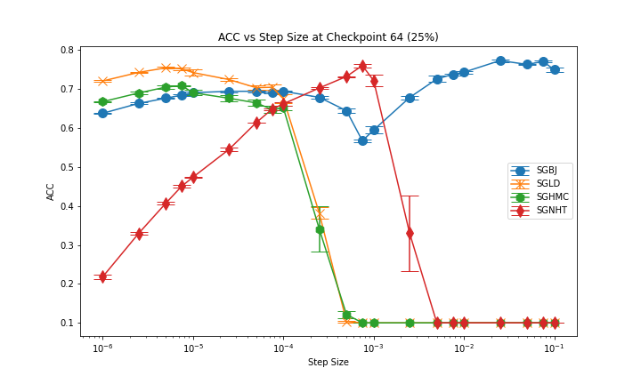

# General Introduction
This folder contains scripts that replicate the CIFAR-10 experiments.

# Scripts Description
**CIFAR10net.py** contains neural networks that trains and conducts inference on the dataset.

**CIFAR10test.py** contains the training and evaluation procedure.

**optimizers.py** contains the samplers. Don't modify otherwise may lead to unexpected errors.

**schedulers.py** contains step size schedulers.

# Replication
Experiments on proposed method VS existing methods can be replicated by above scripts. Metrics used to evaluate is the posterior prediction acc among them. Results see below.

## 25% of the training process

