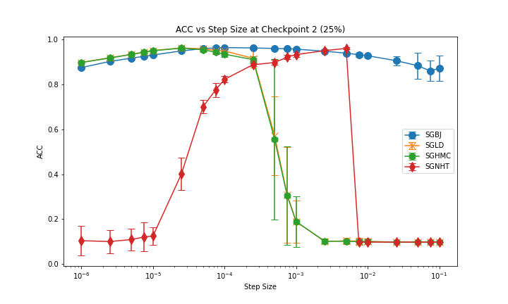
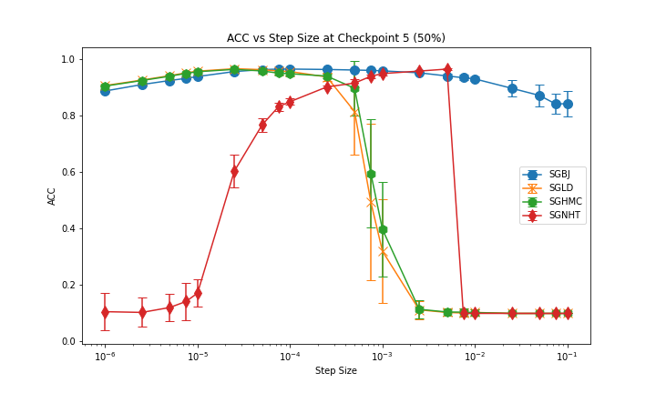
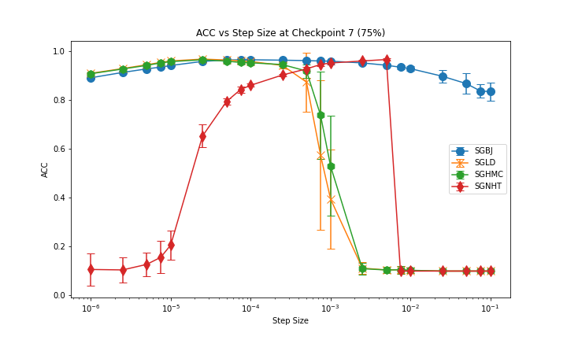
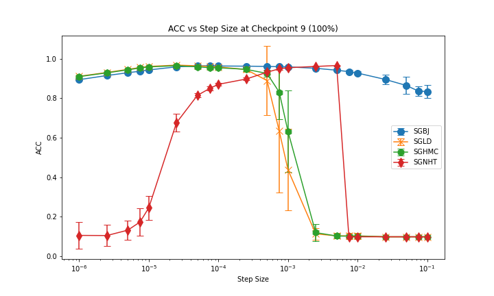
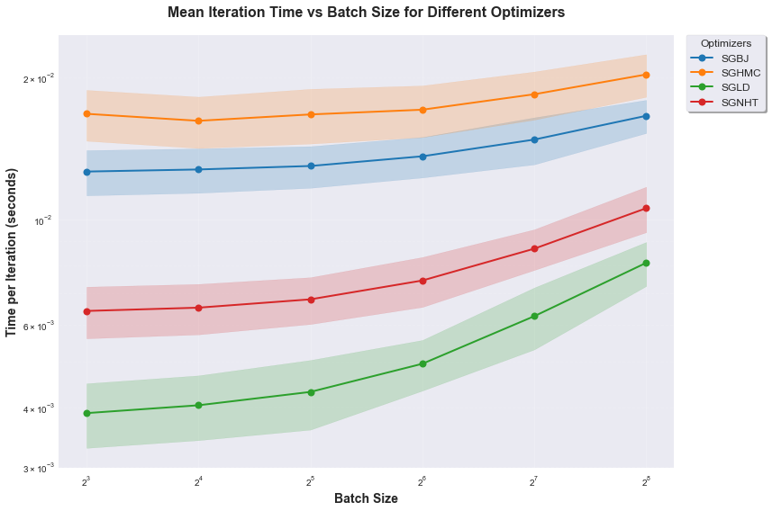

# General Introduction
To replicate the comparison of different samplers on the MNIST dataset, you can run the `python MNISTtest.py` command.

# Scripts and Descriptions
optimizers.py contains the samplers defined. Don't modify otherwise may introduce unexpected errors.

regularizer.py defines some regularizers

schedulers.py defines step size schedulers, which adjusts the step size at each iteration.

MNISTnet.py defines a MLP to perform digit recognition on the MNIST dataset.

MNISTtest.py defines the training script and metric evaluation of digit recognition on the MNIST dataset. 

# Replication
Experiments on proposed method VS existing methods can be replicated by above scripts. Metrics used to evaluate is the posterior prediction acc among them. Results on mean posterior prediction acc and corresponding std see below.

## 25% of the training process

## 50% of the training process

## 75% of the training process

## 100% of the training process

## Time Complexity Comparison (Iteration Time VS Batch Size)

