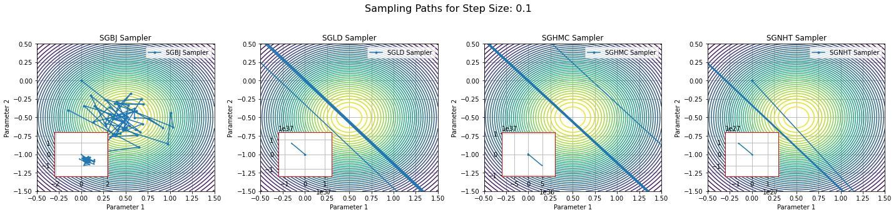

# General Introduction
This folder replicates the toy experiments, by testing sampler on different toy distributions.

# Scripts Descriptions
**Toy.py**: Replication of results on Gaussian posterior.

**ToyT.py**: Replication of results on T posterior.

**ToyMultiModal.py**: Replication of results on a simple multi-modal posterior.

# Replications

Results summarized from different experiments can be founded below.

## Gaussian Distribution
Performance of the proposed method on a Gaussian density under different step sizes compared with other samplers can be found in this section.

### Step Size = 0.1

