# General Introduction
This folder replicates the toy experiments, by testing sampler on different toy distributions.

# Scripts Descriptions
**Toy.py**: Replication of results on Gaussian posterior.

**ToyT.py**: Replication of results on T posterior.

**ToyMultiModal.py**: Replication of results on a simple multi-modal posterior.

# Replications

Results summarized from different experiments can be founded below.

## Gaussian Distribution
Performance of the proposed method on a Gaussian density under different step sizes compared to other samplers can be found in this section.

### Step Size = 0.1

### Step Size = 0.05
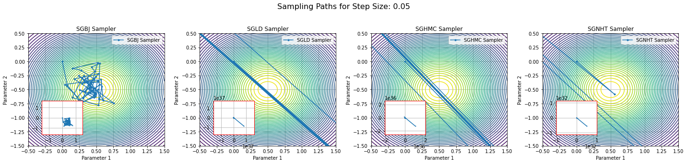

### Step Size = 0.01
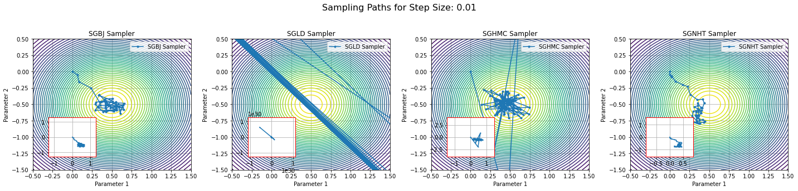

### Step Size = 0.005
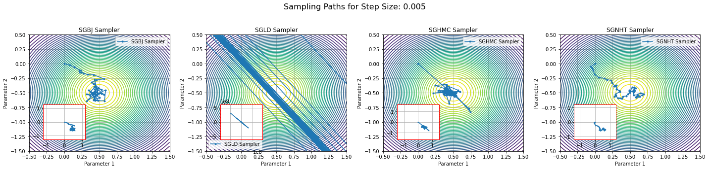

### Step Size = 0.001
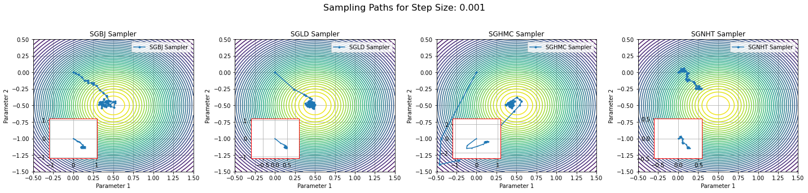

### Step Size = 0.0005
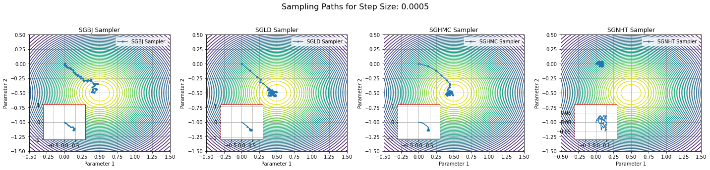

## Heavy-Tailed T Distribution
Performance of the proposed method on a heavy-tailed T density under different step sizes compared to other samplers can be found in this section.

### Step Size = 0.1
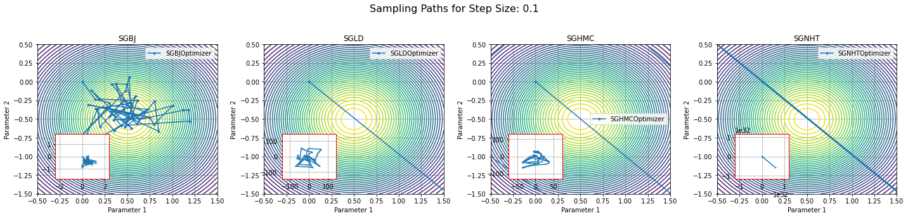

### Step Size = 0.05
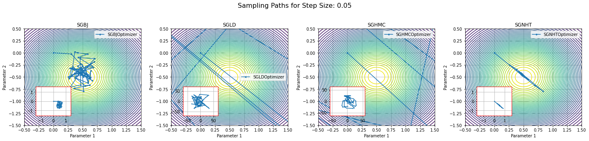

### Step Size = 0.01
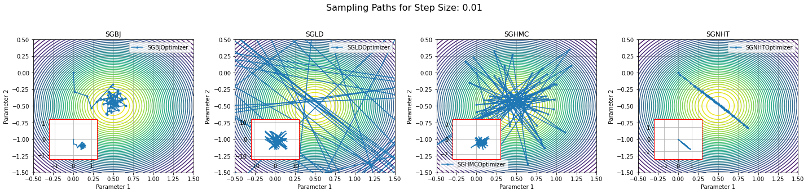

### Step Size = 0.005
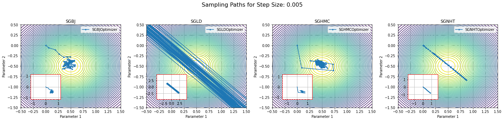

### Step Size = 0.001
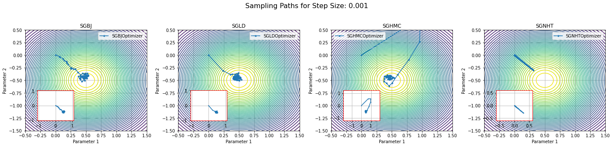

### Step Size = 0.0005
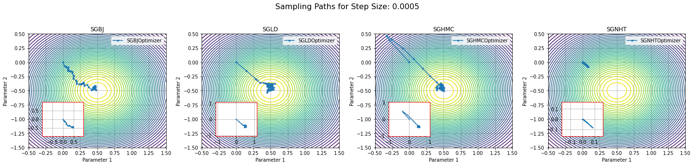

## Gaussian Mixture Distribution
Trace plot of the proposed method on a two-mode Gaussian mixture distribution under different step sizes compared to other samplers can be found in this section.

